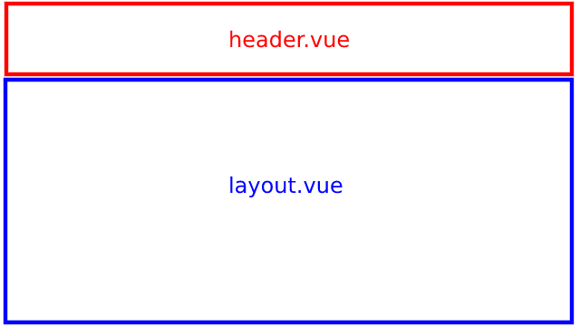
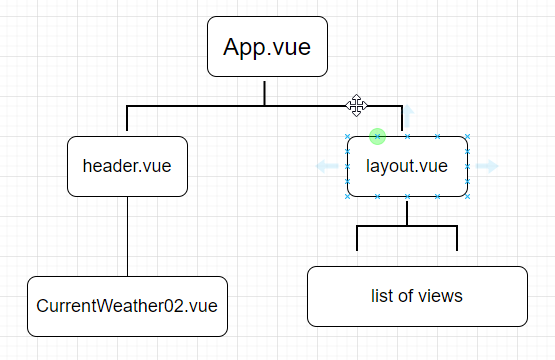
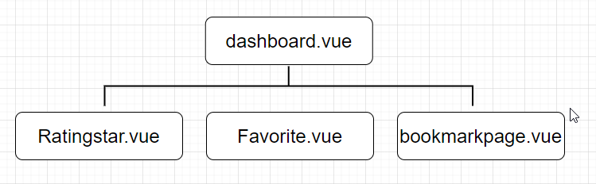

# Assignment of movie online shop

   This is a layout design by using Vue.js 3. This project consists 4 components, 1 router and 9 views. Page navigation is archived by router, coding ```this.$router.push('<any view name>')``` route the replacing page to <router-view>. Thus, single-page web application is archieved by interaction of route-links and route-view.

## Folder structure

```
+-- src
|   +-- assets
|   |   +-- logo.png
|   +-- components
|   |   +-- CurrentWeather02.vue
|   |   +-- Favorite.vue
|   |   +-- PopupMovieEdit.vue
|   |   +-- Ratingstar.vue
|   +-- router
|   |   +-- index.js
|   +-- views
|   |   +-- bookmarkpage.vue
|   |   +-- dashboard.vue
|   |   +-- header.vue
|   |   +-- layout.vue
|   |   +-- login.vue
|   |   +-- moviedetail.vue
|   |   +-- movieforpost.vue
|   |   +-- register.vue
|   |   +-- welcome.vue
|   +-- App.vue
|   +-- main.js
|   +-- .gitignore
|   +-- README.md

```

## Layout
Parts of layout under views directory such as header, layout are **single file component** (i.e. SFC). Inside header, there are CurrentWeather as *inner* components.



## Component hierarchy



## Functions

Movie online shop's functions are archived by different views. As corresponding views are pushed, route-view would be replaced by different views.

| Function | View |
| ------ | ------ |
| User Login | login.vue |
| User Register | register.vue |  
| Movie Search, Add, Delete, Update by Staff role | movieforpost.vue |
| Movie View, bookmark and rate | dashboard.vue |
| Show bookmark page | bookmarkpage.vue |  
| Login out and Weather showing | header.vue |
| Movie Detail | moviedetail.vue |
| Landing Page | welcome.vue |

## Video for demo

## License

MIT
